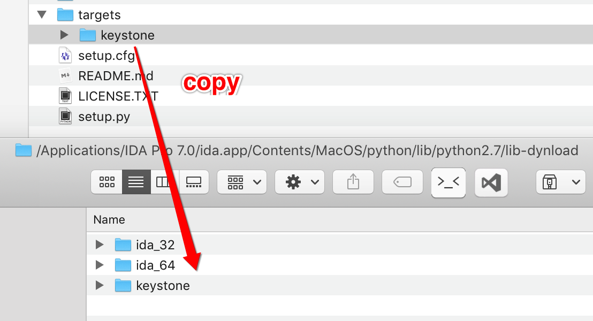

# keystone-engine
keystone-engine bindings python. support `Xcode10` compilation

Usage:

This repo targets "keystone" copy  to lib-dynload.



Compile:

```
git clone https://github.com/fjh658/keystone-engine.git
cd keystone-engine
git submodule update --init --recursive
sudo python setup.py install --verbose
```

